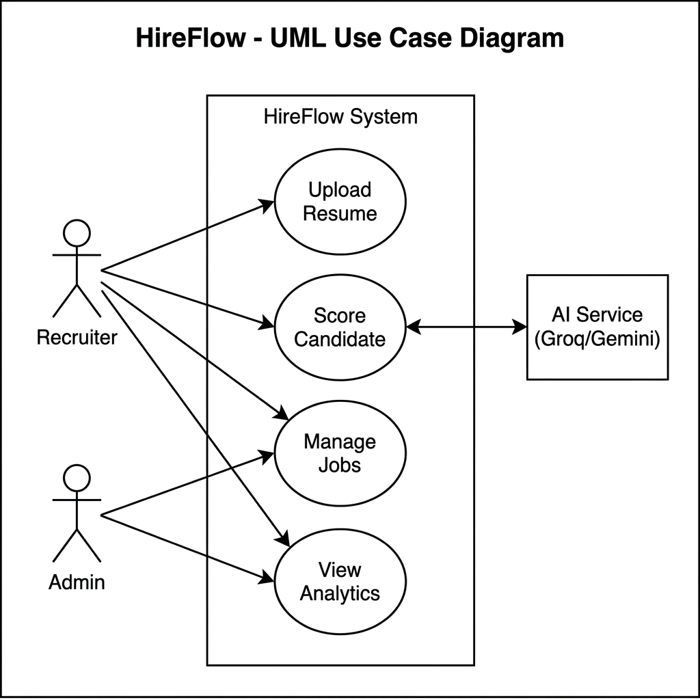
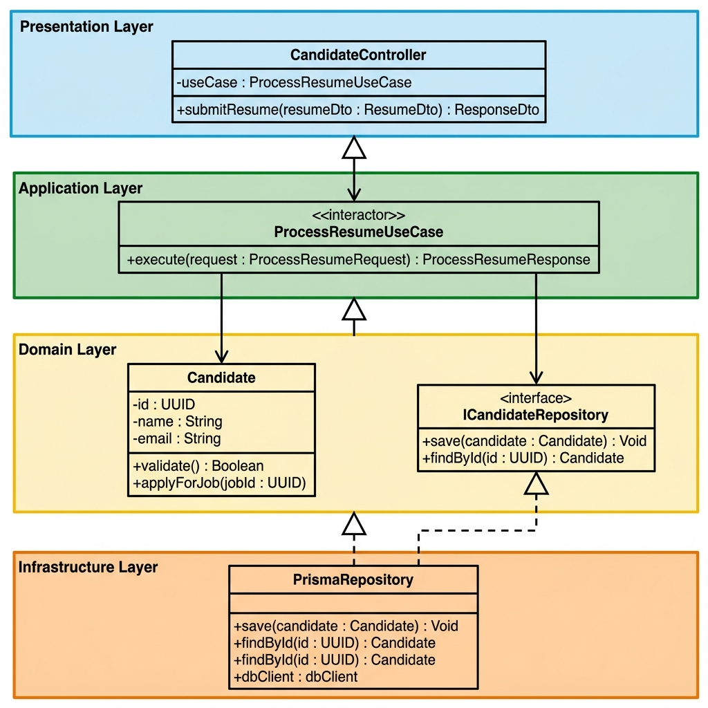
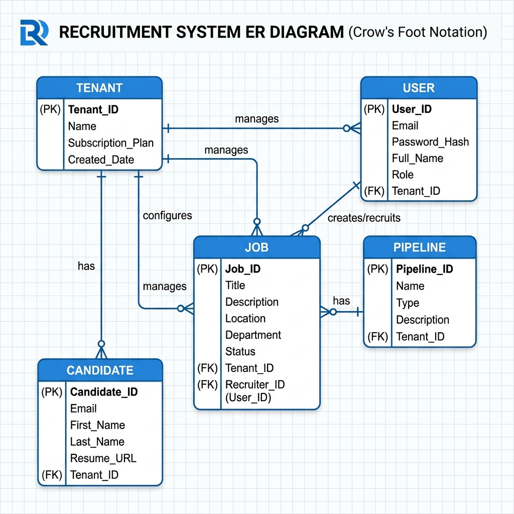

<div align="center">
<h1>🚀 HireFlow</h1>
<h3>AI-Powered B2B Hiring Process Orchestration SaaS</h3>

<p align="center">
  
  
  
</p>

A production-grade, multi-tenant SaaS platform that automates end-to-end recruitment workflows using Groq AI (Llama 3) for intelligent resume parsing and candidate evaluation — built on Clean Architecture with six design patterns and full SOLID compliance.

**Academic Project · Software Design Course · Newton School of Technology · Rishihood University · 2025–26**

</div>

---

## 👥 Team
| Name | Enrolment No. |
| :--- | :--- |
| **Priyansh Satija** | 2401010355 |
| Tathagat Harsh | 2401010477 |
| Bhavay Goyal | 2401010126 |
| Pranav Sehgal | 2401010332 |
| Preet | 2401010352 |

---

## 📋 Table of Contents
- [Overview](#-overview)
- [Key Features](#-key-features)
- [Tech Stack](#-tech-stack)
- [Architecture](#-architecture)
- [Design Patterns](#-design-patterns)
- [SOLID Principles](#-solid-principles)
- [Project Structure](#-project-structure)
- [Getting Started](#-getting-started)
- [Environment Variables](#-environment-variables)
- [API Reference](#-api-reference)
- [Database Schema](#-database-schema)
- [UML Diagrams](#-uml-diagrams)

---

## 🌟 Overview
HireFlow eliminates the pain of manual hiring. Recruiters traditionally spend hours parsing resumes, shuffling spreadsheets, and chasing updates across tools — with zero real-time visibility into pipeline health. HireFlow solves this by:
- **Automating** resume ingestion and structured data extraction via Groq AI.
- **Centralising** the entire hiring pipeline on a visual Kanban board with live WebSocket updates.
- **Scoring** candidates intelligently using pluggable, weighted strategy algorithms.
- **Isolating** every tenant's data at the database layer for true multi-tenant security.

---

## ✨ Key Features

### For Recruiters
- 📄 **AI Resume Parsing**: Upload PDF, DOCX, or TXT; Groq Llama 3 extracts structured skills, experience, education, and projects in under 500 ms.
- 🤖 **AI Candidate Evaluation**: LLM-powered job-fit analysis with strengths, weaknesses, missing skills, and a hire recommendation.
- 📋 **Kanban Pipeline Board**: Drag-and-drop candidate progression with real-time updates.
- 📊 **Analytics Dashboard**: Hiring funnel metrics, stage conversion rates, and team performance.

### For Admins
- 🔐 **Role-Based Access Control**: Admin · Recruiter · Hiring Manager · Interviewer with fine-grained permissions.
- 📝 **Audit Log Viewer**: Full tamper-evident trail of every action across the platform.
- 🏢 **Multi-Tenant Management**: Complete data isolation between organisations at the query level.
- ⚙️ **Pipeline Template Builder**: Define custom hiring stages per job type.

### Technical Highlights
- ⚡ **Real-time WebSockets**: Live pipeline updates without polling.
- 🧩 **6 Design Patterns**: Repository, Strategy, Factory, Observer, Singleton, Dependency Injection.
- 🏛️ **Clean Architecture**: Four strict layers; business logic has zero framework dependencies.
- 🧪 **80%+ Test Coverage**: Unit and integration tests via Jest.

---

## 🛠️ Tech Stack
| Layer | Technology |
| :--- | :--- |
| **Backend** | Node.js 20+ · TypeScript · Express.js |
| **ORM / DB** | Prisma ORM · PostgreSQL 15+ |
| **Queue** | Redis · Bull (background job processing) |
| **AI / ML** | Groq API · Llama 3 (llama-3.3-70b-versatile) |
| **Auth** | JWT · bcrypt · Role-based middleware |
| **Frontend** | Next.js 14 (App Router) · React 18 · TypeScript |
| **Styling** | Tailwind CSS · shadcn/ui |
| **Real-time** | Socket.io (WebSockets) |
| **Testing** | Jest · Supertest |
| **DevOps** | Docker · Vercel (frontend) · Railway (backend) |

---

## 🏛️ Architecture
HireFlow follows **Clean Architecture** — inner layers have no knowledge of outer layers. The dependency rule is enforced by TypeScript interfaces.

```
┌──────────────────────────────────────────────────────┐
│  PRESENTATION LAYER                                  │
│  Express REST API  ·  Next.js UI                     │
│  Controllers · Route handlers · Response DTOs        │
├──────────────────────────────────────────────────────┤
│  APPLICATION LAYER                                   │
│  Use Cases · Orchestrators · Business Logic          │
│  ResumeParsingService · ScoringService · AuditService│
├──────────────────────────────────────────────────────┤
│  DOMAIN LAYER                                        │
│  Entities · Interfaces · Value Objects               │
│  IAIService · IRepository<T> · IScoringStrategy      │
├──────────────────────────────────────────────────────┤
│  INFRASTRUCTURE LAYER                                │
│  Prisma ORM · GroqAIService · Redis · File Storage   │
│  Concrete repos · Parsers · Queue workers            │
└──────────────────────────────────────────────────────┘
```

---

## 🎨 Design Patterns

### 1. Repository Pattern
All data access is behind a generic contract. Prisma implementations in the infrastructure layer ensure the application layer is 100% database-agnostic.
*Location: `src/domain/repositories/`*

### 2. Strategy Pattern
CandidateScorer aggregates weighted scores from multiple interchangeable strategies — SkillsMatch, Experience, Education — selected at runtime.
*Location: `src/application/strategies/`*

### 3. Factory Pattern
Dynamically selects the correct parser (PDF, DOCX, TXT) at runtime. Adding a new format requires zero changes to existing callers.
*Location: `src/infrastructure/parsers/`*

### 4. Observer Pattern
Domain events (CandidateCreated, StageChanged) trigger decoupled side effects like WebSocket notifications and audit logging.
*Location: `src/infrastructure/events/`*

### 5. Singleton Pattern
Ensures shared instances for the DI Container, Config Manager, and Event Emitter across the application lifecycle.
*Location: `src/infrastructure/di/`*

### 6. Dependency Injection
The DI Container wires concrete implementations (GroqAIService, PrismaRepository) to their interfaces at startup.
*Location: `src/infrastructure/di/setupContainer.ts`*

---

## ✅ SOLID Principles
- **S — Single Responsibility**: Each service (Parsing, Scoring, Audit) has one job.
- **O — Open / Closed**: Strategy + Factory patterns allow extensions without code changes.
- **L — Liskov Substitution**: All repository and scoring implementations are fully substitutable.
- **I — Interface Segregation**: Focused, lean interfaces like `IAIService` and `IResumeParser`.
- **D — Dependency Inversion**: High-level modules depend on abstractions (interfaces), not concrete implementations.

---

## 📁 Project Structure
```
B2B-Interview-Hiring-Process-Orchestration-SaaS/
├── backend/
│   ├── prisma/            # DB Schema & Migrations
│   ├── src/
│   │   ├── domain/        # Entities & Interfaces (Inner Layer)
│   │   ├── application/   # Use Cases (Business Logic)
│   │   ├── infrastructure/# Implementations (Prisma, AI, Storage)
│   │   └── presentation/  # API Controllers & Routes
├── frontend/              # Next.js 14 Application
├── SYSTEM_DESIGN_DOCS/    # UML & System Diagrams
└── report/                # Final Project Report PDF
```

---

## 🚀 Getting Started

### 1. Clone & Install
```bash
git clone https://github.com/couchpotato027/B2B-Interview-Hiring-Process-Orchestration-SaaS.git
npm install
```

### 2. Environment Setup
Create a `.env` file in the `backend/` directory with your `DATABASE_URL`, `JWT_SECRET`, and `GROQ_API_KEY`.

### 3. Database & Run
```bash
npx prisma migrate dev
npm run dev
```

---

## 📐 UML Diagrams
Located in `SYSTEM_DESIGN_DOCS/`:
- **Use Case**: `USE_CASE_DIAGRAM.png`
- **Class Diagram**: `CLASS_DIAGRAM.png`
- **ER Diagram**: `ER_DIAGRAM.png`

---

<div align="center">
Made with ❤️ by Team HireFlow · Newton School of Technology · 2026
</div>
