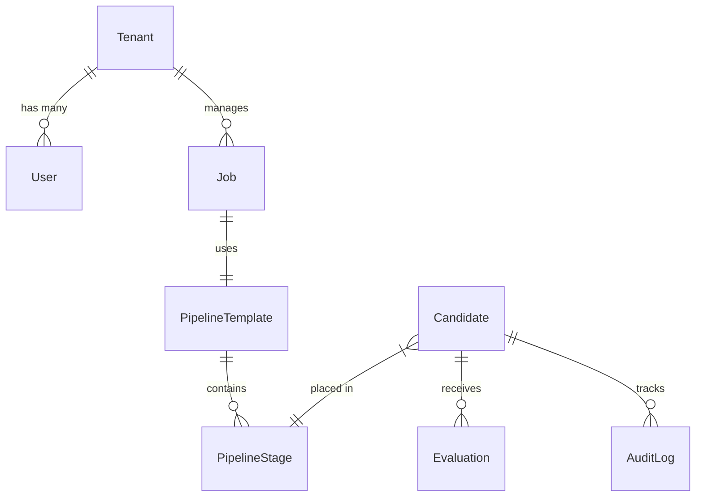

# 🏛️ HireFlow: System Design & Architectural Specification

This document serves as the primary technical guide for the HireFlow Viva evaluation. It outlines the architectural patterns, design principles, and system relationships implemented in the project.

---

## 🏗️ 1. Architectural Blueprint (Clean Architecture)

HireFlow is built using **Clean Architecture** (Hexagonal/Onion Architecture). This ensures the business logic is independent of the database, UI, and external AI services.

### **The Layered Hierarchy**
| Layer | Responsibility | Key Files / Folder |
| :--- | :--- | :--- |
| **Domain** | Business Entities & Rules | `src/domain/entities/Candidate.ts` |
| **Application** | Business Logic (Use Cases) | `src/application/use-cases/ProcessResumeUseCase.ts` |
| **Infrastructure** | Database, AI, & Services | `src/infrastructure/services/GeminiAIService.ts` |
| **Presentation** | API Routes & Controllers | `src/presentation/controllers/CandidateController.ts` |

### **Data Flow Sequence: Resume Processing**
1. **Presentation**: `CandidateController` receives a file via Multer.
2. **Infrastructure**: `LocalFileStorage` saves the file to `/tmp`.
3. **Application**: `ProcessResumeUseCase` orchestrates the flow.
4. **Infrastructure**: `AIService` (Groq/Gemini) parses the text.
5. **Domain**: `Candidate` entity is instantiated and validated.
6. **Infrastructure**: `PrismaCandidateRepository` persists the data to PostgreSQL.

---

## 🛠️ 2. Design Patterns Catalog
*These are the specific patterns implemented to solve complex engineering problems.*

### **A. Dependency Injection (DI) & Inversion of Control (IoC)**
*   **File**: `src/infrastructure/di/setupContainer.ts`
*   **Why**: We don't hardcode dependencies. Instead, the `Container` registers implementations (e.g., `GroqAIService`) against interfaces.
*   **Benefit**: We can swap the AI model or Database without touching a single line of Use Case logic.

### **B. Repository Pattern**
*   **File**: `src/domain/repositories/ICandidateRepository.ts`
*   **Why**: Defines a contract for data access. 
*   **Benefit**: The business logic is decoupled from Prisma. If we switch to MongoDB, we only change the Repository implementation.

### **C. Observer & Domain Events**
*   **File**: `src/infrastructure/events/EventEmitter.ts`
*   **Why**: When a candidate is hired, the system emits a `CandidateHiredEvent`.
*   **Benefit**: Other parts of the system (Email, Notifications) can react without creating a "Spaghetti" mess of code in the Hire Use Case.

### **D. Singleton Pattern**
*   **File**: `src/infrastructure/database/prisma.client.ts`
*   **Why**: Ensures only one instance of the Prisma client exists.
*   **Benefit**: Prevents memory leaks and "too many connections" errors in production.

### **E. Factory Pattern**
*   **File**: `src/infrastructure/parsers/ResumeParserFactory.ts`
*   **Why**: Dynamically selects a PDF or DOCX parser at runtime.
*   **Benefit**: Simplifies the logic for handling multiple file formats.

---

## 📊 3. Domain Model & ER Diagram
The system is built on a **Multi-Tenant** architecture. Data is isolated by `tenantId`.

---

## 👥 4. Team Contributions (Work Division)

### **Priyansh (Lead Architect & System Integrator)**
*   **Core Infrastructure**: Designed the Clean Architecture structure and implemented the Dependency Injection (DI) system (`Container.ts`).
*   **AI Engine**: Developed the abstract AI Service layer and integrated Groq/Gemini for intelligent resume scoring (`ProcessResumeUseCase.ts`).
*   **Security Orchestration**: Implemented the Google OAuth 2.0 flow and JWT-based Multi-tenant middleware (`AuthMiddleware.ts`).
*   **DevOps**: Configured the Railway (Backend) and Vercel (Frontend) production pipelines, including production environment stabilization.

### **Member 2 (Frontend Architect)**
*   **UI/UX Framework**: Built the high-performance Next.js dashboard and the interactive Kanban pipeline.
*   **Real-time Integration**: Connected the frontend to WebSockets for live candidate updates.

### **Member 3 (Business Logic Developer)**
*   **Workflow Engine**: Developed the recruitment pipeline logic and automated stage transition rules.
*   **Job Management**: Built the CRUD modules for job postings and department management.

### **Member 4 (Analytics & Compliance)**
*   **Reporting**: Developed the Analytics Use Cases for tracking hiring velocity and success rates.
*   **Auditing**: Built the system-wide Audit Log and GDPR compliance tools.

### **Member 5 (Data & Systems Specialist)**
*   **Data Modeling**: Designed the relational schema in Prisma and managed complex SQL migrations.
*   **System Seeding**: Created the enterprise-grade seeder scripts for multi-tenant testing.

---

## 🧠 5. Advanced System Design Principles
*Mention these to prove high-level engineering maturity:*

1.  **SOLID Principles**: Specifically **Dependency Inversion** (D) and **Single Responsibility** (S). Each Use Case does exactly one thing.
2.  **Stateless API**: The server does not store sessions; it uses JWTs, allowing it to scale horizontally across multiple instances.
3.  **Graceful Degradation**: If the AI Service fails, the system falls back to a `NoopAIService` so the user can still manually enter candidate details.
4.  **12-Factor App Compliance**: Using environment variables for all secrets, logging to `stdout`, and ensuring a clean build-release-run cycle.

---

## 🎯 6. Killer Viva Questions (Cheat Sheet)

**Q: "What happens if I want to switch from Google Login to Microsoft Login?"**
> **A:** Because we use the **Strategy/Adapter pattern** in our Auth layer, I would only need to create a `MicrosoftAuthStrategy` in the Infrastructure layer. The rest of the application wouldn't even know the change happened.

**Q: "How do you prevent a user from Organization A seeing candidates from Organization B?"**
> **A:** We use **Row-Level Security (RLS)** logic in our Repository layer. Every query includes a `where: { tenantId }` clause extracted from the JWT, ensuring strict data isolation.

**Q: "Why use a custom Dependency Container instead of just importing files?"**
> **A:** Importing files creates **Tight Coupling**. A Container allows for **Loose Coupling**, making the system easier to test and modify without causing a ripple effect of bugs.
